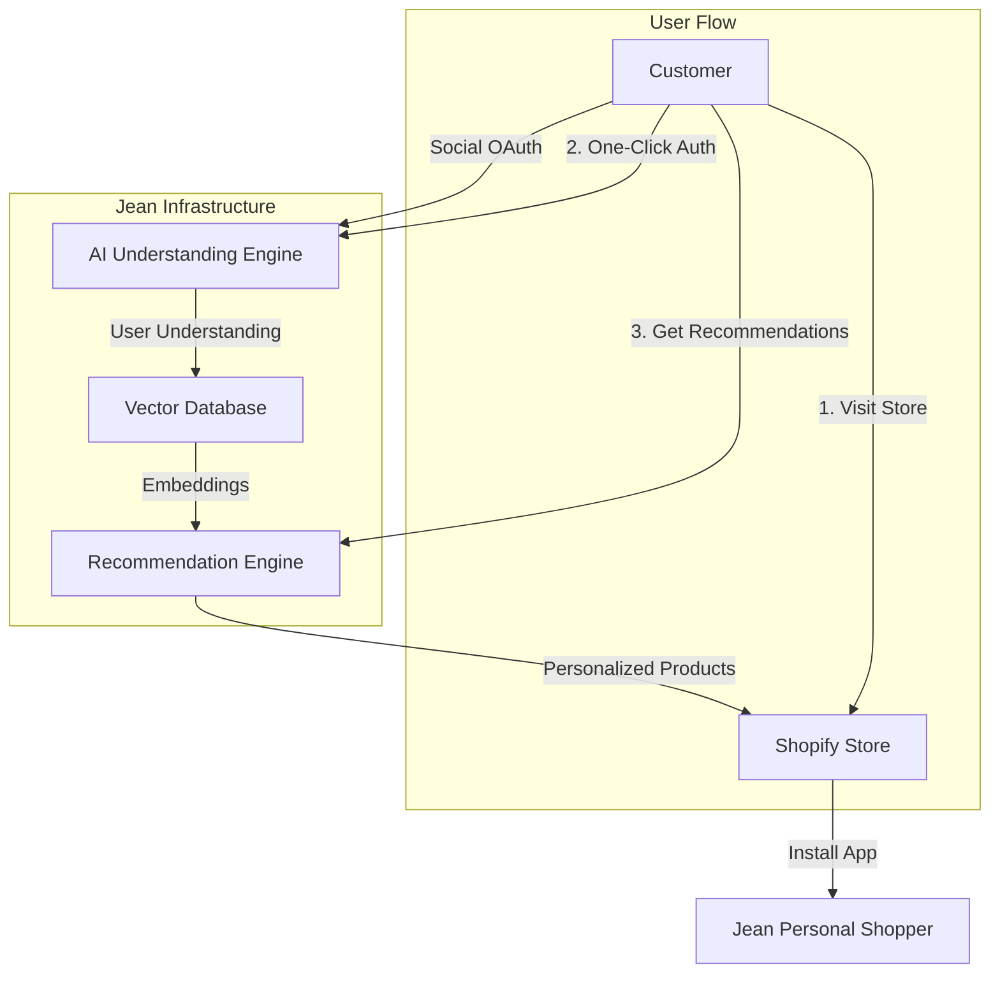
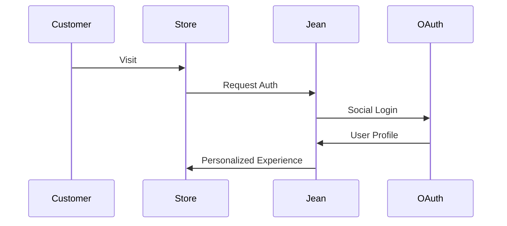

# Jean Personal Shopper

> "Zero to Personalization: Solving E-commerce's Cold Start Problem"

## System Architecture



## The Cold Start Problem

Every e-commerce platform faces the same challenge: new users start with generic, unpersonalized experiences. Traditional solutions require:

- Weeks of behavioral data collection
- Multiple site visits
- Purchase history accumulation
- Extensive user tracking

This leads to lost engagement, reduced conversions, and missed revenue in the critical first customer interactions.

## Our Solution: Instant Understanding

Jean Personal Shopper revolutionizes e-commerce personalization by providing immediate, AI-powered product recommendations from the first visit:

- **Instant Connection:** One-click social authentication
- **Deep Understanding:** AI-powered personality analysis
- **Immediate Value:** Personalized recommendations in seconds
- **User Control:** Privacy-first, opt-in personalization

## Technical Architecture

### Core Infrastructure

- **Frontend:** Remix + Shopify App Framework
- **Authentication:** Dual-layer (Shopify Admin + Supabase User)
- **AI Engine:** OpenAI API for embeddings
- **Vector Store:** Supabase pgvector
- **Data Flow:** Jean Technologies embedding protocol

### System Components

```
jean-shopify/
├── app/
│   ├── components/          # React UI components
│   │   ├── AuthFlow        # OAuth handling
│   │   ├── PersonalityLink # User context
│   │   └── ProductRecs     # Recommendations
│   ├── lib/
│   │   ├── supabase/      # Database & auth
│   │   └── shopify/       # Store integration
│   └── routes/            # App routing & API
├── extensions/            # Shopify theme extension
└── supabase/             # Database schema & functions
```

## Key Features

### Authentication Flow



### Data Flow

1. User authorizes via social platform
2. Profile analyzed by Jean's AI
3. Embeddings generated and stored
4. Products matched using vector similarity
5. Recommendations delivered to store

## Development Setup

### Prerequisites

#### Required accounts
- Shopify Partner Account
- Jean Technologies API access
- Supabase Project

#### Environment Variables
```bash
SHOPIFY_API_KEY=your_key
SHOPIFY_API_SECRET=your_secret
NEXT_PUBLIC_SUPABASE_URL=your_url
NEXT_PUBLIC_SUPABASE_ANON_KEY=your_key
OPENAI_API_KEY=your_key
```

### Quick Start

```bash
# Install dependencies
npm install

# Start development
npm run dev

# Deploy to Shopify
npm run deploy
```

## Integration Points

### Jean Technologies
- Shared Supabase instance
- Common authentication flow
- Unified vector space
- Recommendation engine

### Shopify
- Admin authentication
- Product catalog access
- Theme integration
- Store customization

## Current Status

### Implemented
✅ Basic Shopify app scaffold
✅ Supabase authentication
✅ Social platform integration
✅ Vector similarity search

### In Progress
🔄 Enhanced user understanding
🔄 Product matching refinement
🔄 Merchant analytics
🔄 A/B testing framework

## Future Roadmap

### Near Term
- Advanced personality analysis
- Enhanced product matching
- Merchant dashboard
- Performance optimization

### Long Term
- Custom embedding models
- Real-time personalization
- Multi-platform integration
- Advanced analytics

## Developer Notes

### Critical Considerations

#### Session Management
- Handle both Shopify and Supabase sessions
- Implement token refresh (24h expiry)
- Maintain session sync

#### Data Flow
- Secure OAuth token handling
- RLS policy implementation
- Rate limit management

#### Performance
- Vector similarity optimization
- Product catalog caching
- Response time monitoring

## Support & Resources

- [Jean Technologies Documentation]()
- [Shopify App Development]()
- [Supabase Documentation]()
- Technical Support: support@jean.tech

## Contributing
See CONTRIBUTING.md for development guidelines.

## License
Proprietary. Copyright © 2024 Jean Technologies Inc.

---

Built with Jean Technologies